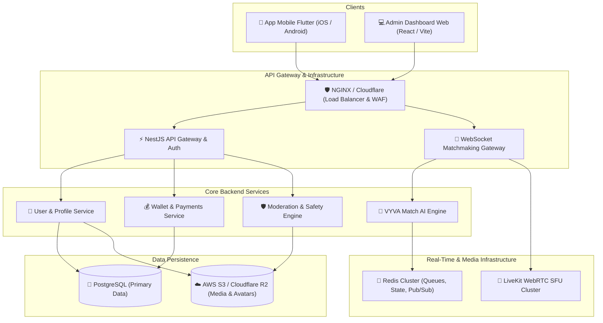
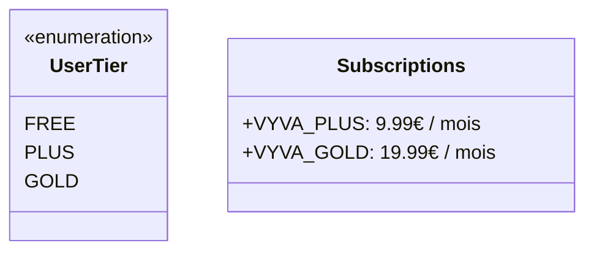
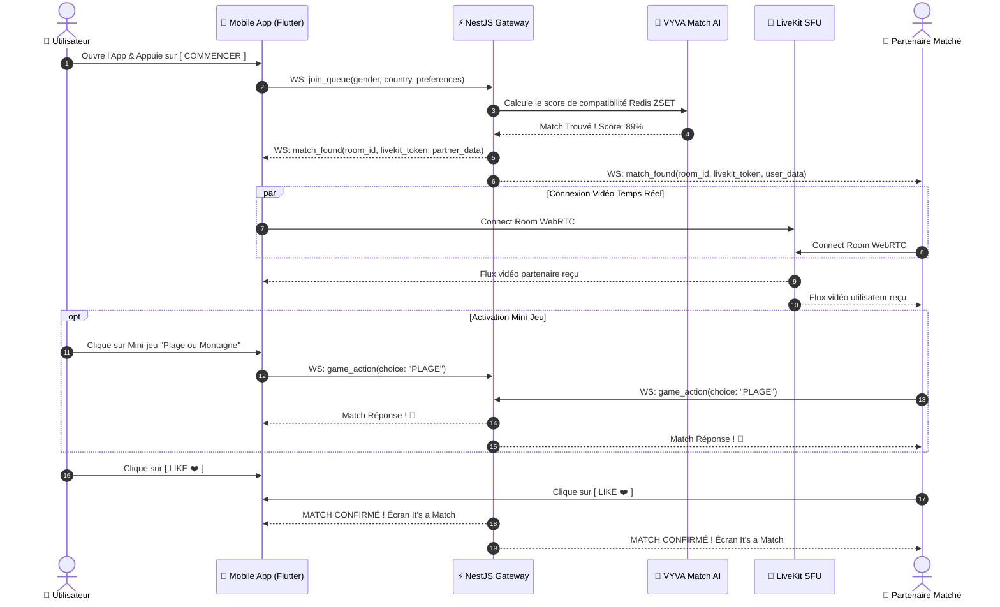
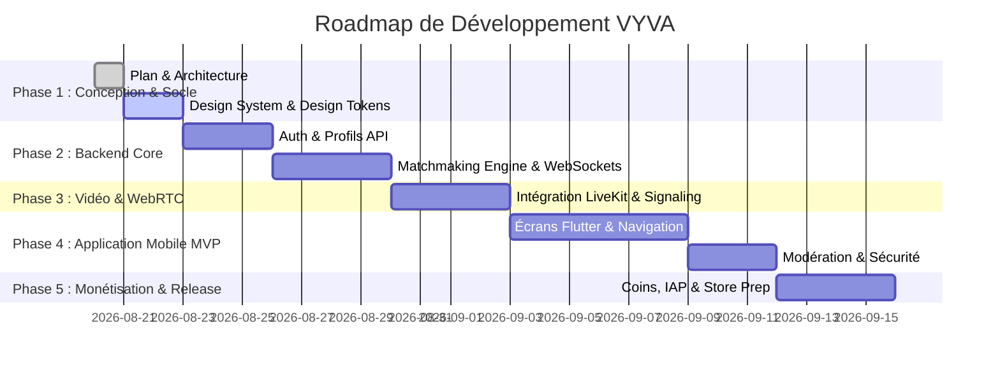

# 🚀 VYVA — SPÉCIFICATIONS TECHNIQUES ET ARCHITECTURE GLOBALE

> **Slogan** : « Le hasard. Mais pas complètement. »  
> **Positionnement** : Application mobile de rencontres sociales vidéo instantanées et intelligentement assorties, enrichies par le Mystery Match, des mini-jeux interactifs et un mode Travel.

---

## 1. ARCHITECTURE COMPLÈTE DU PROJET

L'application VYVA repose sur une architecture microservices modulaires à haute concurrence et très faible latence, adaptée à la vidéo temps réel et au matchmaking à grande échelle.



### Composantes Clés:
- **Mobile Client** : Flutter (iOS & Android) — Codebase unique, 60 FPS, rendu haute performance.
- **Backend API & WebSockets** : Node.js + NestJS — TypeScript, typage strict, architecture événementielle.
- **Serveur Vidéo SFU** : Cluster **LiveKit** (WebRTC open-source / cloud scalable) pour une latence < 150ms et une gestion adaptative de la qualité (Simulcast).
- **Matchmaking & In-Memory Storage** : **Redis Cluster** (Geohashing, Sorted Sets pour les files d'attente, Pub/Sub pour le signalement temps réel).
- **Base de Données Principale** : **PostgreSQL** avec extension PostGIS pour la géolocalisation.
- **Modération Multimédia** : Service hybride (détection automatique de nudité/toxicité par IA via Sightengine / Google Vision API + File de modération humaine).

---

## 2. ARBORESCENCE DES FICHIERS ET STRUCTURE DU CODEBASE

Le projet VYVA est structuré en **Monorepo** propre pour faciliter la cohérence du code, des DTOs et de l'intégration continue.

```
vyva/
├── apps/
│   ├── vyva_mobile/                  # Client Mobile Flutter
│   │   ├── android/
│   │   ├── ios/
│   │   ├── lib/
│   │   │   ├── core/                 # Thème, constantes, utils, réseaux
│   │   │   │   ├── constants/        # Colors (#7C3AED, #FF4F81, etc.), Assets, Endpoints
│   │   │   │   ├── network/          # Dio client, Interceptors JWT, WebSockets
│   │   │   │   ├── theme/            # VYVA Dark Premium Design System (Gradients, Typography)
│   │   │   │   └── utils/            # Validators, Formatter, Helpers
│   │   │   ├── features/             # Modules métier (Clean Architecture par feature)
│   │   │   │   ├── auth/             # Login, Register, Age Verification, OTP
│   │   │   │   ├── profile/          # User Profile, Preferences, Edit, Public View
│   │   │   │   ├── matchmaking/      # Radar search, AI Compatibility, Queues
│   │   │   │   ├── call/             # LiveKit RTC Video screen, Controls, Filters, Mini-games
│   │   │   │   ├── mystery_match/    # Visual blur reveal overlay & logic
│   │   │   │   ├── games/            # Interactive Mini-games overlay (Plage/Montagne, etc.)
│   │   │   │   ├── chat/             # Post-match messaging, Media sharing, Block/Report
│   │   │   │   ├── store/            # Coins shop, VYVA Plus & Gold subscriptions, IAP
│   │   │   │   ├── travel/           # Country selector overlay & active location
│   │   │   │   ├── moderation/       # Instant Report modal, Block list, Safety Center
│   │   │   │   └── settings/         # Privacy, Account Deletion, Push settings
│   │   │   ├── shared/               # Widgets réutilisables (Buttons, Cards, Dialogs, Shimmers)
│   │   │   └── main.dart
│   │   └── pubspec.yaml
│   │
│   ├── vyva_backend/                 # Backend API NestJS
│   │   ├── src/
│   │   │   ├── config/               # Dev/Staging/Prod configs & env validation
│   │   │   ├── modules/
│   │   │   │   ├── auth/             # JWT, OAuth Apple/Google, Phone verification
│   │   │   │   ├── users/            # Management, Profiles, GDPR export/delete
│   │   │   │   ├── matchmaking/      # VYVA MATCH AI algorithm & WS Gateway
│   │   │   │   ├── video/            # LiveKit token generation & Webhook listeners
│   │   │   │   ├── games/            # Mini-games state & sync engine
│   │   │   │   ├── chat/             # Real-time WebSocket Messaging & History
│   │   │   │   ├── wallet/           # Coins transactions & ledger
│   │   │   │   ├── subscriptions/    # Server-side IAP validation (Apple/Google Stores)
│   │   │   │   ├── moderation/       # Report queue, Automated image/frame inspection
│   │   │   │   ├── ads/              # Reward Video Ads server verification
│   │   │   │   └── admin/            # Dashboard APIs & KPIs
│   │   │   ├── common/               # Guards, Interceptors, Filters, Decorators
│   │   │   └── main.ts
│   │   └── package.json
│   │
│   └── vyva_admin/                   # Dashboard Web Administrateur (React / Vite)
│       ├── src/
│       │   ├── components/           # Charts, User Tables, Live Video Moderation Queue
│       │   ├── pages/                # Metrics, Users, Reports, Revenue, Store Settings
│       │   └── App.tsx
│       └── package.json
│
├── docs/                             # Documentation technique & conformité RGPD
└── docker-compose.yml                # Environnement local (PostgreSQL, Redis, LiveKit)
```

---

## 3. SCHÉMA DE BASE DE DONNÉES (POSTGRESQL + TYPEORM)

```sql
-- Utilisateurs principaux
CREATE TABLE users (
    id UUID PRIMARY KEY DEFAULT gen_random_uuid(),
    email VARCHAR(255) UNIQUE,
    phone_number VARCHAR(30) UNIQUE,
    apple_id VARCHAR(255) UNIQUE,
    google_id VARCHAR(255) UNIQUE,
    password_hash VARCHAR(255),
    role VARCHAR(20) DEFAULT 'USER', -- 'USER', 'MODERATOR', 'ADMIN'
    is_verified BOOLEAN DEFAULT FALSE,
    is_age_verified BOOLEAN DEFAULT FALSE,
    birth_date DATE NOT NULL,
    status VARCHAR(20) DEFAULT 'ACTIVE', -- 'ACTIVE', 'SUSPENDED', 'BANNED'
    created_at TIMESTAMP DEFAULT CURRENT_TIMESTAMP,
    updated_at TIMESTAMP DEFAULT CURRENT_TIMESTAMP
);

-- Profils utilisateurs
CREATE TABLE profiles (
    id UUID PRIMARY KEY DEFAULT gen_random_uuid(),
    user_id UUID UNIQUE REFERENCES users(id) ON DELETE CASCADE,
    display_name VARCHAR(50) NOT NULL,
    gender VARCHAR(20) NOT NULL, -- 'MALE', 'FEMALE', 'NON_BINARY'
    target_gender_preference VARCHAR(20) DEFAULT 'EVERYONE', -- 'MALE', 'FEMALE', 'EVERYONE'
    country_code VARCHAR(5) NOT NULL, -- ISO 3166-1 alpha-2 ('FR', 'ES', etc.)
    preferred_language VARCHAR(10) DEFAULT 'fr',
    bio TEXT,
    avatar_url TEXT NOT NULL,
    additional_photos TEXT[], -- Array de 5 photos max
    interests TEXT[], -- Array d'intérêts (ex: ["musique", "voyage", "gaming"])
    reputation_score INT DEFAULT 100, -- Dynamic rating based on interaction quality
    is_premium BOOLEAN DEFAULT FALSE,
    premium_tier VARCHAR(20) DEFAULT 'FREE', -- 'FREE', 'PLUS', 'GOLD'
    premium_until TIMESTAMP,
    coins_balance INT DEFAULT 0,
    created_at TIMESTAMP DEFAULT CURRENT_TIMESTAMP
);

-- Sessions vidéo & Matchs
CREATE TABLE video_sessions (
    id UUID PRIMARY KEY DEFAULT gen_random_uuid(),
    room_id VARCHAR(100) UNIQUE NOT NULL,
    user_a_id UUID REFERENCES users(id),
    user_b_id UUID REFERENCES users(id),
    started_at TIMESTAMP DEFAULT CURRENT_TIMESTAMP,
    ended_at TIMESTAMP,
    duration_seconds INT DEFAULT 0,
    is_mystery_match BOOLEAN DEFAULT FALSE,
    was_matched BOOLEAN DEFAULT FALSE, -- True if both liked each other
    disconnection_reason VARCHAR(50)
);

-- Matchs confirmés (Social / Chat)
CREATE TABLE matches (
    id UUID PRIMARY KEY DEFAULT gen_random_uuid(),
    user_1_id UUID REFERENCES users(id),
    user_2_id UUID REFERENCES users(id),
    matched_at TIMESTAMP DEFAULT CURRENT_TIMESTAMP,
    status VARCHAR(20) DEFAULT 'ACTIVE', -- 'ACTIVE', 'UNMATCHED', 'BLOCKED'
    UNIQUE(user_1_id, user_2_id)
);

-- Messages Chat
CREATE TABLE messages (
    id UUID PRIMARY KEY DEFAULT gen_random_uuid(),
    match_id UUID REFERENCES matches(id) ON DELETE CASCADE,
    sender_id UUID REFERENCES users(id),
    content TEXT,
    media_url TEXT,
    read_at TIMESTAMP,
    created_at TIMESTAMP DEFAULT CURRENT_TIMESTAMP
);

-- Ledger Coins & Transactions
CREATE TABLE coin_transactions (
    id UUID PRIMARY KEY DEFAULT gen_random_uuid(),
    user_id UUID REFERENCES users(id),
    amount INT NOT NULL, -- positive for purchase/reward, negative for spending
    transaction_type VARCHAR(30) NOT NULL, -- 'PURCHASE', 'BOOST', 'RECONNECT', 'TRAVEL', 'REWARD_AD'
    reference_id VARCHAR(255), -- Store transaction ID or Ad ID
    created_at TIMESTAMP DEFAULT CURRENT_TIMESTAMP
);

-- Signalements & Modération
CREATE TABLE moderation_reports (
    id UUID PRIMARY KEY DEFAULT gen_random_uuid(),
    reporter_id UUID REFERENCES users(id),
    reported_user_id UUID REFERENCES users(id),
    session_id UUID REFERENCES video_sessions(id),
    reason VARCHAR(50) NOT NULL, -- 'NUDITY', 'HARASSMENT', 'UNDERAGE', 'SPAM', 'OTHER'
    comment TEXT,
    snapshot_url TEXT, -- Automated frame capture if flagged
    status VARCHAR(20) DEFAULT 'PENDING', -- 'PENDING', 'RESOLVED_NO_ACTION', 'WARNING_ISSUED', 'BANNED'
    reviewed_by UUID REFERENCES users(id),
    created_at TIMESTAMP DEFAULT CURRENT_TIMESTAMP
);
```

---

## 4. APIS ET PROTOCOLES RÉSEAU

### A. REST APIs (HTTPS / JSON)
- **Authentification** : `POST /api/v1/auth/register`, `POST /api/v1/auth/login`, `POST /api/v1/auth/verify-age`, `POST /api/v1/auth/refresh`
- **Profil & Préférences** : `GET /api/v1/users/me`, `PUT /api/v1/users/profile`, `PUT /api/v1/users/preferences`
- **Store & Monétisation** : `GET /api/v1/store/products`, `POST /api/v1/store/verify-purchase`, `POST /api/v1/store/claim-reward-ad`
- **Chat & Amis** : `GET /api/v1/matches`, `GET /api/v1/matches/:id/messages`, `POST /api/v1/matches/:id/unmatch`
- **Sécurité & Signaux** : `POST /api/v1/moderation/report`, `POST /api/v1/moderation/block`

### B. WebSocket Gateway (`wss://api.vyva.app/matchmaking`)
- **Événements Client -> Serveur** :
  - `join_queue` : `{ mode: 'STANDARD'|'MYSTERY', gender_pref: 'FEMALE', country: 'FR' }`
  - `leave_queue` : `{}`
  - `next_match` : `{ current_room_id: "..." }`
  - `game_action` : `{ room_id: "...", choice: "PLAGE" }`
  - `reveal_mystery` : `{ room_id: "..." }`
  - `rate_moment` : `{ room_id: "...", rating: "FIRE" }`
- **Événements Serveur -> Client** :
  - `match_found` : `{ room_id: "...", livekit_token: "...", match_score: 87, partner_info: {...} }`
  - `partner_disconnected` : `{ room_id: "..." }`
  - `mystery_revealed` : `{ user_id: "..." }`
  - `game_result` : `{ user_a_choice: "...", user_b_choice: "...", matched: true }`

---

## 5. SYSTÈME D'AUTHENTIFICATION & SÉCURITÉ DES ACCÈS

1. **Fournisseurs d'identité** :
   - Email + Mot de passe (hachage **Argon2id**).
   - Connexion Téléphone via **Firebase Phone Auth / SMS OTP**.
   - OAuth 2.0 / OIDC native : **Sign in with Apple** & **Google Sign-In**.
2. **Tokens & Sessions** :
   - Access Token JWT (Durée de vie : 15 min, signé RS256).
   - Refresh Token stocké dans le trousseau sécurisé mobile (iOS Keychain / Android EncryptedSharedPreferences).
3. **Contrôle d'âge (Strict 18+)** :
   - Calcul strict de l'âge à partir de la date de naissance.
   - Intégration de la vérification d'identité automatisée (SumSub / Persona / Yoti) si exigé par la législation locale ou l'App Store.

---

## 6. ALGORITHME VYVA MATCH AI (MATCHMAKING INTELLIGENT)

```
Score de Compatibilité (0-100%) = 
  (0.25 * ScoreIntérêts) + 
  (0.20 * ScoreLanguePays) + 
  (0.20 * ScoreRéputationQualité) + 
  (0.15 * ScorePréférenceDurée) + 
  (0.20 * BonusPremium)
```

### Algorithme de File d'Attente Redis :
- **Sorted Sets (ZSET)** par région/pays et préférences de genre.
- **Pondération dynamique** : L'algorithme élargit progressivement les critères (ex: de France à Europe) après 5 secondes d'attente pour garantir un temps d'attente < 3 secondes.
- **Fairness Engine (Équité)** : Empêche un utilisateur d'être reconnecté aux 10 dernières personnes rencontrées et pénalise les profils à fort taux d'instant-skip (< 2 sec).

---

## 7. ARCHITECTURE VIDÉO TEMPS RÉEL (WEBRTC SFU)

- **Technologie** : Cluster LiveKit SFU (Selective Forwarding Unit).
- **Latence cible** : < 150 ms en 4G/5G/Wi-Fi.
- **Qualité dynamique** : Simulcast adaptatif (720p / 480p / 240p) en fonction de la bande passante de l'utilisateur.
- **Mécanisme Reconnect** : En cas d'interruption réseau de moins de 10s, la session WebRTC tente une reconnexion transparente sans rompre l'appel.

---

## 8. SYSTÈME DE MONNAIE VIRTUELLE : VYVA COINS

### Packs de Coins :
- **100 Coins** — 0,99 €
- **500 Coins** — 4,99 €
- **1 200 Coins** (+20% bonus) — 9,99 €
- **3 000 Coins** (+50% bonus) — 22,99 €

### Consommation des Coins (Sinks) :
| Fonctionnalité | Coût en Coins | Description |
| :--- | :--- | :--- |
| **Boost Profil** | 50 Coins | Priorité maximale dans le matchmaking pendant 30 min |
| **Reconnect** | 30 Coins | Demande de re-match avec la dernière personne vidéo |
| **Travel Pass (24h)** | 100 Coins | Débloque le choix direct du pays de rencontre |
| **Super Like** | 20 Coins | Notification spéciale au profil liké avec message direct |

---

## 9. MONÉTISATION & ABONNEMENTS (VYVA PLUS & VYVA GOLD)



### Grille Comparative des Offres :
| Fonctionnalités | Gratuit | VYVA Plus (9,99 €/mois) | VYVA Gold (19,99 €/mois) |
| :--- | :---: | :---: | :---: |
| **Matchmaking Vidéo Illimité** | ✅ | ✅ | ✅ |
| **Zero Publicité Interstitielle** | ❌ | ✅ | ✅ |
| **Filtre de Genre (Mode Hommes / Femmes)** | ❌ | ✅ | ✅ |
| **Choix du Pays (Mode Travel)** | ❌ | ✅ | ✅ |
| **Coins mensuels offerts** | 0 | 200 Coins / mois | 600 Coins / mois |
| **Priorité de Matchmaking AI** | Standard | Élevée | Priorité Absolue ⭐ |
| **Badge Profil Gold & Effets VIP** | ❌ | ❌ | ✅ |
| **Accès exclusif Mystery Match VIP** | ❌ | ❌ | ✅ |

---

## 10. SYSTÈME PUBLICITAIRE ET REWARD ADS

1. **Publicité Native / Interstitielle** :
   - Affichée uniquement entre 2 sessions vidéo (jamais pendant un appel en cours).
   - Fréquence maximale : 1 publicité tous les 5 matchs gratuits.
2. **Reward Ads (Sans Dark Pattern)** :
   - Bouton volontaire « Regarder une courte vidéo (+10 Coins) ».
   - Validation serveur via webhook d'AdMob / Unity Ads pour créditer le compte.

---

## 11. SÉCURITÉ ET SENSITIVE CONTENT MODERATION

- **Modération Automatisée des Flux** : Capture de frame aléatoire (toutes les 15 secondes) transmise à l'API de modération AI (Sightengine) pour détecter la nudité, la violence ou le contenu inapproprié.
- **Bouton Quitter & Signaler Instantané** : Visible en permanence d'une seule main pendant l'appel vidéo.
- **Action Automatique** : 
  - 1er avertissement AI -> Suspension temporaire du flux vidéo.
  - Signalements multiples -> Placé en file d'attente de modération humaine prioritaire.

---

## 12. TABLEAU DE BORD ADMINISTRATEUR (PANEL WEB)

Vue d'ensemble des fonctionnalités clés du Dashboard React/Vite :
1. **KPIs en Temps Réel** : DAU, MAU, Temps moyen d'appel, Taux de conversion Premium, Revenue du jour.
2. **Queue de Modération Vidéo** : Inspection des snapshots de signalements avec actions (Warning, Bannissement IP/Device, Rejet).
3. **Gestion des Utilisateurs** : Recherche, historique des achats, levée de bannissement, vérification d'âge.
4. **Gestion des Tarifs & Feature Flags** : Modification à chaud des coûts de Coins et activations des fonctionnalités.

---

## 13. ÉCRANS ET EXPÉRIENCE UTILISATEUR (UX/UI)

### Charte Graphique & Palette :
- **Violet Électrique (Primaire)** : `#7C3AED`
- **Rose Corail (Secondaire)** : `#FF4F81`
- **Rose Clair (Accent)** : `#FF7EB3`
- **Noir Profond (Background)** : `#09090B`
- **Surface Cartes** : `#18181B`

### Liste des Écrans (25 Écrans Méticuleusement Spécifiés) :
1. `SplashScreen` : Animation du logo VYVA avec effet néon dégradé.
2. `OnboardingScreen` : Carrousel 3 slides ("Rencontres Instantanées", "Mystery Match", "Mini-jeux").
3. `RegisterScreen` : Sélection Email/Apple/Google/Phone.
4. `AgeVerificationScreen` : Date de naissance + Déclaration sur l'honneur 18+.
5. `ProfileSetupScreen` : Pseudo, photos, genre, centres d'intérêt.
6. `MatchmakingCenterScreen` : Écran principal avec bouton central vibrant **[ 🎥 COMMENCER ]**, sélecteurs de filtre (Genre, Pays).
7. `SearchingScreen` : Animation de radar / particules néon avec score de compatibilité VYVA MATCH AI (ex: "Compatibilité : 87%").
8. `VideoCallScreen` : Plein écran vidéo distant + vignette vidéo locale, commandes 1 main (Suivant, Micro, Caméra, Mini-jeux, Report).
9. `MysteryMatchOverlayScreen` : Flou artistique progressif avec timer et bouton réciproque **[ Révéler ]**.
10. `GamesOverlayScreen` : Questions interactives synchronisées (ex: "Plage ou Montagne ?").
11. `VyvaMomentScreen` : Modal de fin d'appel (Emojis : 😐, 🙂, 😍, 🔥).
12. `MatchResultScreen` : Écran "It's a Match !" en cas de Like réciproque.
13. `ChatListScreen` : Liste des matchs actifs et conversations.
14. `ChatDetailScreen` : Messagerie textuelle, GIF, messages vocaux.
15. `FavoritesScreen` : Liste des profils favoris ou recontactables.
16. `HistoryScreen` : Historique des personnes récemment croisées.
17. `StoreCoinsScreen` : Achat de packs de Coins avec badges "Populaire" / "Meilleure Offre".
18. `StorePremiumScreen` : Présentation immersive de VYVA Plus & Gold.
19. `RewardAdsModal` : Modal clair pour visionner une vidéo et gagner des Coins.
20. `NotificationsScreen` : Historique des matchs, super likes et promos.
21. `SettingsScreen` : Préférences de l'application, compte, son.
22. `SecurityCenterScreen` : Bloquer/Débloquer, conseils de sécurité.
23. `ReportModalScreen` : Formulaire rapide de signalement avec motifs préremplis.
24. `PublicProfileScreen` : Vue détaillée d'un profil matché.
25. `UserStatsDashboard` : Statistiques d'interaction utilisateur (Temps d'appel cumulé, matchs réussis).

---

## 14. PARCOURS UTILISATEUR COMPLET (USER JOURNEY)



---

## 15. COÛTS TECHNIQUES ESTIMÉS (INFRASTRUCTURE)

### Estimation mensuelle selon le volume (DAU) :

| Post de Dépense | 1 000 DAU | 10 000 DAU | 100 000 DAU |
| :--- | :--- | :--- | :--- |
| **Serveurs Vidéo LiveKit (SFU & Bandwidth)** | 40 € / mois | 350 € / mois | 2 800 € / mois |
| **API Gateway & Workers (NestJS)** | 20 € (Hetzner/DigitalOcean) | 120 € / mois | 800 € / mois |
| **PostgreSQL & Redis Managed** | 25 € / mois | 150 € / mois | 750 € / mois |
| **API Modération Vidéo AI (Sightengine)** | 30 € / mois | 250 € / mois | 1 500 € / mois |
| **SMS OTP & Firebase Auth** | 15 € / mois | 100 € / mois | 600 € / mois |
| **Total Estimé Infrastructure** | **~130 € / mois** | **~970 € / mois** | **~6 450 € / mois** |

---

## 16. DÉPENDANCES ET BIBLIOTHÈQUES UTILISÉES

### App Mobile Flutter (`pubspec.yaml`) :
- `flutter_bloc` / `flutter_riverpod` : Gestion d'état réactive.
- `livekit_client` : Kit SDK WebRTC haute performance.
- `dio` & `web_socket_channel` : Communications REST & WebSockets.
- `in_app_purchase` : In-App Purchases Apple & Google Store.
- `google_mobile_ads` : Intégration AdMob & Rewarded Video Ads.
- `cached_network_image` & `flutter_animate` : Rendu UI d'excellence.

### Backend NestJS (`package.json`) :
- `@nestjs/core`, `@nestjs/websockets`, `@nestjs/typeorm`.
- `livekit-server-sdk` : Gestion des rooms et tokens vidéo.
- `ioredis` : Gestionnaire Redis Cluster.
- `jsonwebtoken`, `argon2`, `class-validator`.

---

## 17. RISQUES TECHNIQUES ET SOLUTIONS

1. **Latence réseau & NAT Traversal (WebRTC)** :
   - *Solution* : Déploiement de serveurs STUN/TURN distribués mondialement (Twilio TURN / LiveKit Cloud).
2. **Engorgement de la file de Matchmaking** :
   - *Solution* : Exécution des calculs de compatibilité en mémoire via Redis Lua Scripts avec fallback progressif.
3. **Consommation Batterie & Surchauffe Mobile** :
   - *Solution* : Encapsulation Hardware de la capture vidéo via Metal (iOS) et Vulkan/OpenGL (Android).

---

## 18. CONFORMITÉ ET RÈGLES DES STORES (APPLE & GOOGLE)

1. **Apple Guideline 1.2 (User Generated Content)** :
   - Implémentation obligatoire du filtrage d'images inappropriées, blocage en 1 clic et modération sous 24h.
2. **Achats In-App (Apple 3.1.1 & Google Play Billing)** :
   - Validation stricte des reçus côté serveur NestJS via l'API Apple App Store Server et Google Play Developer API.
3. **Règles Anti-Discrimination** :
   - Présentation des filtres de genre comme préférences d'assortiment et non comme garantie de disponibilité.

---

## 19. CONFORMITÉ RGPD & PROTECTION DES DONNÉES

- **Minimisation des Données** : Pas de géolocalisation GPS exacte conservée ; stockage uniquement du code pays/région.
- **Droit à l'Oubli (Article 17)** : Bouton « Supprimer mon compte » dans les paramètres supprimant toutes les données et photos sous 72h.
- **Exportation des Données (Article 20)** : Fonctionnalité de téléchargement d'archive JSON du profil et de l'historique.

---

## 20. ROADMAP COMPLÈTE DU DÉVELOPPEMENT



---
*Ce document sert de spécification de référence pour le développement intégral du projet VYVA.*
